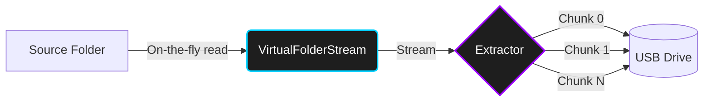

<div align="center">
  

  # Oppaku File Chunker & Archiver

  **A cryptographic, sparse-file based zero-storage utility for transporting massive files via tiny storage devices.**

  [](https://github.com/ali38958/Oppaku-Chunker/releases/tag/v0.7.0)
  [](https://dotnet.microsoft.com/)
  [](https://github.com/ali38958/Oppaku-Chunker/releases)
  [](#-license--ownership)
  [](CONTRIBUTING.md)

  [📦 Download v0.7.0](https://github.com/ali38958/Oppaku-Chunker/releases/tag/v0.7.0) • [✨ Features](#-why-is-oppaku-unique) • [🏗️ Architecture](#-zero-storage-architecture) • [⚡ Quick Start](#-getting-started) • [💻 CLI Reference](#-cli-reference) • [🤝 Contributing](#-contributing)

</div>

---

## 📖 The Problem It Solves

Oppaku is a powerful utility designed to solve a very specific problem: moving incredibly large files (or massive folders) between computers using storage devices (like USBs) that are significantly smaller than the files themselves.

Unlike traditional file splitters that require all parts to be present on the destination machine before reassembling (which defeats the purpose if your target hard drive is almost full), Oppaku leverages **Sparse File** technology. It immediately creates the massive target file on the destination machine and allows you to inject chunks into it *in any order, one by one*.

---

## ✨ Why is Oppaku Unique?

- 🧩 **Sequential Injection**: You don't need all chunks on the target machine at once. Carry Chunk 1 on a USB, inject it, delete it, go back for Chunk 2, and repeat — the destination drive is never overfilled.
- 📦 **Universal Solid Archives**: Creates `.oppaku-archive` files using standard ZIP containers (`PK\x03\x04`), directly extractable by **PeaZip, 7-Zip, WinRAR, and Windows File Explorer**.
- 🗜️ **Multi-Level Compression**: Four compression tiers (`None → Normal → High → Extreme`) using industry-standard algorithms.
- 🚀 **Zero-Storage Streaming**: A custom `VirtualFolderStream` reads the source directory on-the-fly and slices chunks **without creating any temporary files**.
- 🔒 **Cryptographic Verification**: SHA-256 hash is embedded in every chunk's metadata — `finalise` mathematically guarantees a bit-for-bit perfect rebuild.
- 🖥️ **Dual Interface**: A modern WPF GUI and a full-featured terminal CLI sharing the same engine.

---

## 🏗️ Zero-Storage Architecture



By streaming directly from the file system, Oppaku bypasses `%TEMP%` file creation, saving gigabytes of local storage during compression and chunking.

---

## ⚡ Getting Started

### 📦 Windows Installer — Zero Dependencies (Recommended)

> **[⬇️ Download Oppaku-Setup.msi (v0.7.0)](https://github.com/ali38958/Oppaku-Chunker/releases/tag/v0.7.0)**

The installer is **fully self-contained** — no .NET runtime required on the target machine.

| What it does | Detail |
|---|---|
| Installs to | `C:\Oppaku` |
| CLI available globally | `oppaku` works in any terminal after install |
| Start Menu shortcut | Launches `OppakuGUI.exe` |
| Maintenance | Repair and Uninstall via Windows Settings |

---

### 🖥️ Running from Source

#### Prerequisites
- [.NET 10.0 SDK](https://dotnet.microsoft.com/download/dotnet/10.0)

#### Clone & Run:
```bash
git clone https://github.com/ali38958/Oppaku-Chunker.git
cd Oppaku-Chunker

# Run GUI
dotnet run --project src/Oppaku.Gui

# Run CLI
dotnet run --project src/Oppaku.Cli -- --help
```

#### Build Your Own MSI:
```powershell
powershell -ExecutionPolicy Bypass -File installer/build_installer.ps1
# Output: publish/Oppaku-Setup.msi
```

---

## 💻 CLI Reference

```powershell
# Show version
oppaku --version

# Create an extreme-compressed solid archive
oppaku archive --source .\my-folder --dest .\backup.oppaku-archive --compression extreme

# Extract an archive
oppaku unarchive --source .\backup.oppaku-archive --dest .\output

# Split a large file/folder into 2 GB chunks
oppaku extract --source "C:\LargeGame" --dest "E:\USB" --size 2 --unit GB --parts all

# Insert chunks into target (sparse file, any order)
oppaku rebuild --chunks "E:\USB\LargeGame.part0.oppk;E:\USB\LargeGame.part1.oppk" --dest "D:\Restored"

# Verify the final rebuilt file
oppaku finalise --chunk "E:\USB\LargeGame.part0.oppk" --dest "D:\Restored\LargeGame.zip"
```

---

## 💡 Tips & Best Practices

> [!TIP]
> **Keep Chunk Size Consistent**: Always use the same chunk size for all parts of a file during extraction. Oppaku uses exact byte offsets, but the progress tracker stores indices `[0 ... N]` based on the size chosen — mixing sizes causes index warnings during `finalise`.

> [!NOTE]
> **Universal Archive Compatibility**: `.oppaku-archive` files use standard ZIP containers and can be opened directly in 7-Zip, PeaZip, WinRAR, and Windows Explorer without any Oppaku installation.

---

## 📁 Project Structure

| Module | Description |
|--------|-------------|
| `Oppaku.Core` | The shared engine: Hashing, Chunking, Rebuilding, Archiving, Cryptography, and Virtual Streams. |
| `Oppaku.Gui` | Windows WPF graphical interface (`OppakuGUI.exe`). |
| `Oppaku.Cli` | Terminal command-line interface (`oppaku.exe`). |
| `tests/` | xUnit test suite — 17 tests covering cryptographic integrity and archive format correctness. |
| `installer/` | WiX v5 MSI installer source and build script. |

---

## 🤝 Contributing

Contributions are warmly welcomed! If you'd like to fix a bug, optimize performance, or propose an enhancement:

1. Read [CONTRIBUTING.md](CONTRIBUTING.md) for coding standards and PR workflow.
2. Fork the repository and create a dedicated branch.
3. Ensure all tests pass: `dotnet test`
4. Open a Pull Request with clear description and verification steps.

> [!NOTE]
> All pull requests are reviewed by Muhammad Ali. By submitting a contribution, you agree your work is licensed under the [Oppaku License](LICENSE.md) and that project ownership and release management remain with the author.

---

## 📄 License & Ownership

Oppaku is created, maintained, and owned by **Muhammad Ali**.

Licensed for **personal, non-commercial use only**. Unauthorized redistribution, commercial use, or claiming ownership is strictly prohibited. See [LICENSE.md](LICENSE.md) for full terms.

<div align="center">
  <br />
  <sub>Made by <b>Muhammad Ali</b></sub>
  <br />
  <a href="https://github.com/ali38958">GitHub Profile</a> • <a href="https://github.com/ali38958/Oppaku-Chunker">Repository</a> • <a href="https://github.com/ali38958/Oppaku-Chunker/releases">Releases</a>
</div>
