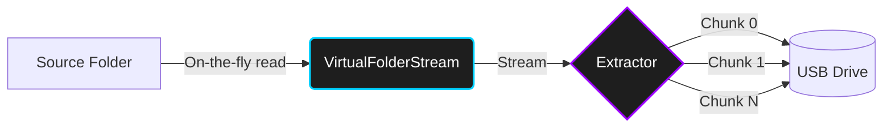

<div align="center">
  

  # Oppaku File Chunker & Archiver
  
  **A cryptographic, sparse-file based zero-storage utility for transporting massive files via tiny storage devices.**

  [](https://dotnet.microsoft.com/)
  [](https://github.com/ali38958/Oppaku-Chunker)
  [](#-license)
  [](CONTRIBUTING.md)

  [✨ Features](#-why-is-oppaku-unique) • [🏗️ Architecture](#-zero-storage-architecture) • [⚡ Quick Start](#-getting-started) • [💻 Dual Interfaces](#-dual-interfaces) • [🤝 Contributing](#-contributing) • [📄 License](#-license)

</div>

---

## 📖 The Problem It Solves

Oppaku is a powerful utility designed to solve a very specific problem: moving incredibly large files (or massive folders) between computers using storage devices (like USBs) that are significantly smaller than the files themselves.

Unlike traditional file splitters that require all parts to be present on the destination machine before reassembling (which defeats the purpose if your target hard drive is almost full), Oppaku leverages **Sparse File** technology. It immediately creates the massive target file on the destination machine and allows you to inject chunks into it *in any order, one by one*.

## ✨ Why is Oppaku Unique?

- 🧩 **Sequential Injection**: You don't need all chunks on the target machine at once. You can move Chunk 1 with a small USB, inject it, delete it from the USB, go back for Chunk 2, and repeat.
- 📦 **Universal Solid Archives**: Oppaku creates `.oppaku-archive` and `.zip` archives with industry-standard container structures (`PK\x03\x04`), making them directly extractable by **PeaZip, 7-Zip, WinRAR, and Windows File Explorer** while retaining legacy fallback support.
- 🗜️ **Brotli Compression & AES-256**: Archives can be compressed up to 'Extreme' level using multi-tier compression mapping.
- 🚀 **Zero-Storage Streaming**: When chunking large folders, Oppaku utilizes a custom `VirtualFolderStream` to calculate hashes and slice chunks on the fly directly from the source directory, **without creating any intermediate temp files**.
- 🔒 **Cryptographic Verification**: The original file's SHA-256 hash is embedded directly into the chunk's metadata. When you are done rebuilding, Oppaku mathematically guarantees your final file is a bit-for-bit perfect match.

---

## 🏗️ Zero-Storage Architecture

Our latest engine utilizes a completely stream-based pipeline to eliminate disk I/O bottlenecks.



By streaming directly from the file system, Oppaku bypasses the need for massive `%TEMP%` files, saving you gigabytes of local storage during the compression and chunking process.

---

## 💻 Dual Interfaces

Oppaku provides two native ways to interact with the engine, sharing the same `Oppaku.Core` library.

### 1. The WPF GUI (`OppakuGUI.exe`)
A beautiful, modern Windows application featuring dynamic progress tracking, native file exploration, and intuitive dialogs for compression levels and overwrite safety.

### 2. The Terminal CLI (`oppaku.exe`)
A robust, cross-platform command-line interface perfect for scripts, automation, or headless servers.

```powershell
# Create an extreme-compressed solid archive
oppaku archive --source .\my-folder --dest .\backup.oppaku-archive --compression extreme

# Safely extract an archive
oppaku unarchive --source .\backup.oppaku-archive --dest .\output
```

---

## ⚡ Getting Started

### 📦 Windows MSI Installer (Recommended)
You can install Oppaku on Windows with the native **`.msi`** installer:
- **Default Installation**: Installs to `C:\Oppaku` with self-contained GUI (`OppakuGUI.exe`) and CLI (`oppaku.exe`) executables (**zero .NET runtime required**).
- **System PATH**: Automatically adds `oppaku` CLI to your terminal PATH.
- **Shortcuts**: Adds Start Menu and Desktop shortcuts for the GUI.
- **Maintenance**: Native Windows Repair and Uninstall support.

To build the MSI installer locally:
```powershell
powershell -ExecutionPolicy Bypass -File installer/build_installer.ps1
```
The resulting installer will be generated at `publish/Oppaku-Setup.msi`.

---

### Running from Source

#### Prerequisites
- [.NET 10.0 SDK](https://dotnet.microsoft.com/download/dotnet/10.0)

#### Run via .NET CLI:
```bash
# Run GUI Application
dotnet run --project src/Oppaku.Gui

# Run CLI Application
dotnet run --project src/Oppaku.Cli -- --help
```

---

## 💡 Important Tips & Best Practices

> [!TIP]
> **Keep Chunk Size Consistent for a File**:
> Oppaku writes each chunk to its exact physical byte offset in the destination file. However, the progress tracker embeds chunk indices `[0 ... N]` based on your chosen chunk size.
> - Always use the **same chunk size** for all parts of a single file during extraction so that `finalise` can cleanly verify completeness across the full index range without index mismatch warnings.

---

## 📁 Project Structure

| Module | Description |
|--------|-------------|
| `Oppaku.Core` | The shared engine: Hashing, Chunking, Rebuilding, Cryptography, and Virtual Streams. |
| `Oppaku.Gui` | The Windows Presentation Foundation (WPF) graphical user interface. |
| `Oppaku.Cli` | The command-line interface wrapper for headless execution. |
| `tests/` | xUnit test suite for the core engine verifying cryptographic integrity. |

---

## 🤝 Contributing

Contributions from the community are warmly welcomed! If you'd like to fix a bug, optimize streaming performance, expand test coverage, or propose an enhancement:

1. Read our [CONTRIBUTING.md](CONTRIBUTING.md) guide for architecture conventions, coding standards, and PR workflows.
2. Fork the repository on GitHub and create a dedicated branch for your fix/feature.
3. Ensure all tests pass cleanly using `dotnet test`.
4. Open a Pull Request with a clear description of your changes and verification steps.

> [!NOTE]
> All pull requests are reviewed by Muhammad Ali. By submitting a contribution, you agree that your work is licensed under the [Oppaku License](LICENSE.md) and that overall project ownership, branding, and release management remain with the author.

---

## 📄 License & Ownership

Oppaku is created, maintained, and owned by **Muhammad Ali**.

This software is licensed for **personal, non-commercial use only**. Community contributions and patches via Pull Requests are welcomed under the terms set in [CONTRIBUTING.md](CONTRIBUTING.md).

Unauthorized redistribution, public mirroring, re-uploading binaries, commercial use, or claiming ownership of this software is strictly prohibited. For complete terms and legal details, please read [LICENSE.md](LICENSE.md).

<div align="center">
  <br />
  <sub>Made by <b>Muhammad Ali</b></sub>
  <br />
  <a href="https://github.com/ali38958">GitHub Profile</a> • <a href="https://github.com/ali38958/Oppaku-Chunker">Repository</a>
</div>
