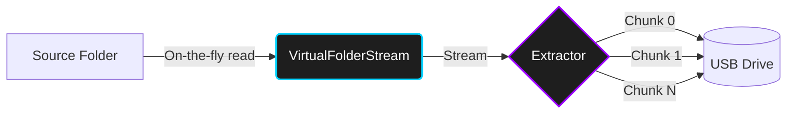

<div align="center">
  

  # Oppaku File Chunker & Archiver
  
  **A cryptographic, sparse-file based zero-storage utility for transporting massive files via tiny storage devices.**

  [](https://dotnet.microsoft.com/)
  [](https://github.com/ali38958/Oppaku-Chunker)
  [](#-license)

  [✨ Features](#-why-is-oppaku-unique) • [🏗️ Architecture](#-zero-storage-architecture) • [⚡ Quick Start](#-getting-started) • [💻 Dual Interfaces](#-dual-interfaces)

</div>

---

## 📖 The Problem It Solves

Oppaku is a powerful utility designed to solve a very specific problem: moving incredibly large files (or massive folders) between computers using storage devices (like USBs) that are significantly smaller than the files themselves.

Unlike traditional file splitters that require all parts to be present on the destination machine before reassembling (which defeats the purpose if your target hard drive is almost full), Oppaku leverages **Sparse File** technology. It immediately creates the massive target file on the destination machine and allows you to inject chunks into it *in any order, one by one*.

## ✨ Why is Oppaku Unique?

- 🧩 **Sequential Injection**: You don't need all chunks on the target machine at once. You can move Chunk 1 with a small USB, inject it, delete it from the USB, go back for Chunk 2, and repeat.
- 📦 **Solid Archives (V2)**: Oppaku can now create `.oppaku-archive` solid archives that bundle multiple files into one highly compressed payload.
- 🗜️ **Brotli Compression & AES-256**: Archives can be heavily compressed (up to 'Extreme' level) using Brotli algorithms and securely encrypted via AES-256 CBC.
- 🚀 **Zero-Storage Streaming**: When chunking large folders, Oppaku utilizes a custom `VirtualFolderStream` to calculate hashes and slice chunks on the fly directly from the source directory, **without creating any intermediate temp files**.
- 🔒 **Cryptographic Verification**: The original file's SHA-256 hash is embedded directly into the chunk's metadata. When you are done rebuilding, Oppaku mathematically guarantees your final file is a bit-for-bit perfect match.

---

## 🏗️ Zero-Storage Architecture

Our latest V2 engine utilizes a completely stream-based pipeline to eliminate disk I/O bottlenecks.



By streaming directly from the file system, Oppaku bypasses the need for massive `%TEMP%` files, saving you gigabytes of local storage during the compression and chunking process.

---

## 💻 Dual Interfaces

Oppaku provides two native ways to interact with the engine, sharing the same `Oppaku.Core` library.

### 1. The WPF GUI
A beautiful, modern Windows application featuring dynamic progress tracking, native file exploration, and intuitive dialogs for compression levels and overwrite safety.

### 2. The Terminal CLI
A robust, cross-platform command-line interface perfect for scripts, automation, or headless servers.

```powershell
# Create an extreme-compressed solid archive
oppaku archive --source .\my-folder --dest .\backup.oppaku-archive --compression extreme

# Safely extract an archive
oppaku unarchive --source .\backup.oppaku-archive --dest .\output
```

---

## ⚡ Getting Started

### Prerequisites

- [.NET 10.0 SDK](https://dotnet.microsoft.com/download/dotnet/10.0)

### Installation

1. **Clone the repository**
   ```bash
   git clone https://github.com/ali38958/Oppaku-Chunker.git
   cd Oppaku-Chunker
   ```

2. **Run the GUI Application**
   ```bash
   dotnet run --project src/Oppaku.Gui
   ```

3. **Run the CLI Application**
   ```bash
   dotnet run --project src/Oppaku.Cli -- --help
   ```

### 📦 Building Standalone Executables

If you want to build a single `.exe` file that you can share with computers that don't have .NET installed:

**Build GUI:**
```bash
dotnet publish src\Oppaku.Gui -c Release -r win-x64 --self-contained
```
*(The executable will be located at `src\Oppaku.Gui\bin\Release\net10.0-windows\win-x64\publish\Oppaku.exe`)*

**Build CLI:**
```bash
dotnet publish src\Oppaku.Cli -c Release -r win-x64 --self-contained
```
*(The executable will be located at `src\Oppaku.Cli\bin\Release\net10.0\win-x64\publish\oppaku.exe`)*

---

## 📁 Project Structure

| Module | Description |
|--------|-------------|
| `Oppaku.Core` | The shared engine: Hashing, Chunking, Rebuilding, Cryptography, and Virtual Streams. |
| `Oppaku.Gui` | The Windows Presentation Foundation (WPF) graphical user interface. |
| `Oppaku.Cli` | The command-line interface wrapper for headless execution. |
| `tests/` | xUnit test suite for the core engine verifying cryptographic integrity. |

---

## 📄 License

This project is proprietary and copyrighted by Muhammad Ali. Unauthorized copying, modification, distribution, or claiming ownership of this software is strictly prohibited. See the [LICENSE.md](LICENSE.md) file for more details.

<div align="center">
  <br />
  <sub>Built with ❤️ by <b>Muhammad Ali</b></sub>
  <br />
  <a href="https://github.com/ali38958">GitHub Profile</a> • <a href="https://github.com/ali38958/Oppaku-Chunker">Repository</a>
</div>
