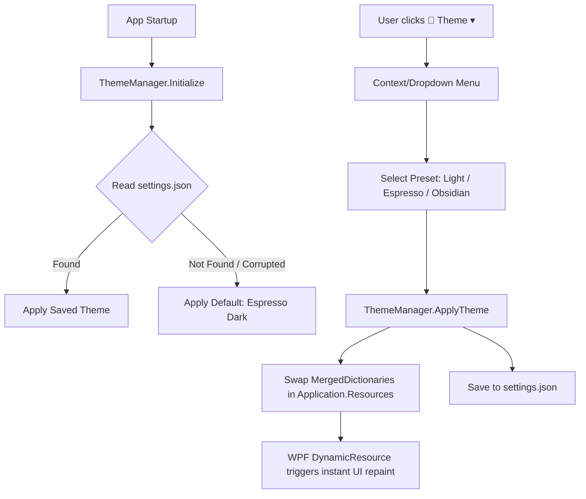

# Oppaku — Multi-Preset Theme System Plan

> **Type:** DESKTOP / WPF GUI Feature
> **Slug:** `theme-system`
> **Created:** 2026-08-21
> **Status:** Completed

---

## 🎯 Goal

Implement a dynamic, runtime multi-preset theming engine for the Oppaku WPF desktop application. The system will support 3 polished themes (**Sandstone Light**, **Espresso Dark**, and **Obsidian Slate**) switchable on the fly without restarting the application, with user preferences persisted in a portable `settings.json` file located next to the executable.

---

## ✨ Success Criteria

- [x] Instant, flicker-free theme switching at runtime via `DynamicResource` bindings.
- [x] 3 complete, balanced color presets:
  - **Sandstone Light**: Warm cream/sand base with burnt-orange accents.
  - **Espresso Dark**: Deep rich chocolate/coffee dark mode with warm highlights.
  - **Obsidian Slate**: Modern neutral dark slate/charcoal with crisp cool accents.
- [x] Sleek `🎨 Theme ▾` dropdown button positioned on the far right of the top toolbar.
- [x] Active theme indicated with a checkmark in the dropdown menu.
- [x] Portable persistence via `settings.json` saved alongside the application binary.
- [x] Safe fallback to default theme (`Espresso Dark`) if `settings.json` is missing or invalid.
- [x] All UI components (Window, Toolbar, TreeView, ListView, Dialog ActionPanel, Status bar, Progress bar) update seamlessly upon theme change.

---

## 🎨 Theme Specifications

| Token | Sandstone Light | Espresso Dark (Default) | Obsidian Slate |
|---|---|---|---|
| `BgBase` | `#FDF4EF` (Cream) | `#1E1612` (Espresso) | `#14171A` (Obsidian) |
| `BgSurface` | `#FFFFFF` (White) | `#261D18` (Dark Mocha) | `#1B2026` (Dark Slate) |
| `BgPanel` | `#F5EBE4` (Light Tan) | `#231A15` (Mocha Panel) | `#181E24` (Slate Panel) |
| `BgToolbar` | `#E8C9B0` (Warm Tan) | `#19110D` (Deep Espresso) | `#11161B` (Deep Slate) |
| `BgHover` | `#EDE0D6` (Soft Tan) | `#352922` (Warm Hover) | `#26303B` (Slate Hover) |
| `BgSelected` | `#B5654A` (Accent) | `#9E533A` (Warm Selected) | `#1B4F72` (Slate Selected) |
| `BgInput` | `#FFFFFF` (White) | `#2B201A` (Dark Input) | `#1F262E` (Slate Input) |
| `Accent` | `#B5654A` (Burnt Orange) | `#C26E52` (Warm Ember) | `#3898EC` (Electric Slate Blue) |
| `AccentHover` | `#9E533A` (Deep Orange) | `#D97E62` (Bright Ember) | `#5DADE2` (Bright Blue) |
| `TxtPrimary` | `#212529` (Dark Charcoal) | `#E8DDD7` (Warm Bone) | `#F0F4F8` (Crisp Ice) |
| `TxtSecondary` | `#495057` (Slate Gray) | `#B8A9A0` (Muted Bone) | `#8899A6` (Slate Muted) |
| `TxtMuted` | `#6C757D` (Subtle Gray) | `#85746C` (Dim Muted) | `#657786` (Dim Slate) |
| `Border` | `#E8D8CC` (Soft Tan Border) | `#3D2E26` (Dark Border) | `#2C3640` (Slate Border) |
| `BorderAccent` | `#B5654A` (Orange Border) | `#C26E52` (Ember Border) | `#3898EC` (Blue Border) |

---

## 🏗️ Architecture & Component Design

---

## 📋 Task Breakdown

### Phase 1 — Theme Resource Dictionaries
- [x] **T1.1** — Create `src/Oppaku.Gui/Themes/ThemePreset.cs` enum definition (`SandstoneLight`, `EspressoDark`, `ObsidianSlate`).
- [x] **T1.2** — Create `src/Oppaku.Gui/Themes/SandstoneLightTheme.xaml` with complete palette brush definitions.
- [x] **T1.3** — Create `src/Oppaku.Gui/Themes/EspressoDarkTheme.xaml` with warm espresso dark palette brush definitions.
- [x] **T1.4** — Create `src/Oppaku.Gui/Themes/ObsidianSlateTheme.xaml` with modern obsidian slate palette brush definitions.

### Phase 2 — Theme Manager & Portable Persistence
- [x] **T2.1** — Create `src/Oppaku.Gui/Services/AppSettings.cs` model for serializing portable application configuration (Theme, Window bounds).
- [x] **T2.2** — Implement `src/Oppaku.Gui/Services/ThemeManager.cs`:
  - `ApplyTheme(ThemePreset preset)`: replaces active theme `ResourceDictionary` in `Application.Current.Resources.MergedDictionaries`.
  - `LoadSettings()`: safely reads `settings.json` adjacent to `AppDomain.CurrentDomain.BaseDirectory`.
  - `SaveSettings()`: writes updated theme configuration atomically.

### Phase 3 — XAML Dynamic Resource Binding Overhaul
- [x] **T3.1** — Update `App.xaml` to merge the active theme dictionary at root and configure controls to consume dynamic palette tokens.
- [x] **T3.2** — Convert all color brush references in `MainWindow.xaml` (Borders, Backgrounds, TextBlocks, ListViews, TreeViews, Dialogs) to `{DynamicResource ...}`.
- [x] **T3.3** — Ensure control templates (TreeViewItem, ListViewItem, Buttons, TextBoxes) properly respond to dynamic brush swaps without stale static caches.

### Phase 4 — Top Bar Theme Selector UI
- [x] **T4.1** — Add a `🎨 Theme ▾` button on the far right of the top toolbar in `MainWindow.xaml` using `ToolbarBtn` styling.
- [x] **T4.2** — Implement context menu popup with checkmark icons beside the currently active theme:
  - `✓ Sandstone Light`
  - `✓ Espresso Dark`
  - `✓ Obsidian Slate`
- [x] **T4.3** — Connect click event handlers to `ThemeManager.ApplyTheme()`.

---

## 🧪 Phase X — Verification Checklist

- [x] `dotnet build` compiles cleanly with zero warnings or errors.
- [x] App launches with default `Espresso Dark` theme when no `settings.json` exists.
- [x] Clicking `🎨 Theme ▾` displays the menu with checkmarks reflecting current selection.
- [x] Switching between all 3 themes updates the whole interface immediately with zero lag or visual artifacts:
  - [x] Top bar header and toolbar buttons.
  - [x] Path navigation bar and folder/file trees.
  - [x] ListView headers, rows, and selected items.
  - [x] Right-side Action Panel (Insert chunks, Create archive, Extract archive, Hash check).
  - [x] Bottom status bar and expandable activity log.
- [x] Exiting the app and relaunching restores the exact theme selected in the previous session from `settings.json`.
- [x] Deleting `settings.json` safely falls back to `Espresso Dark` without crashing.
